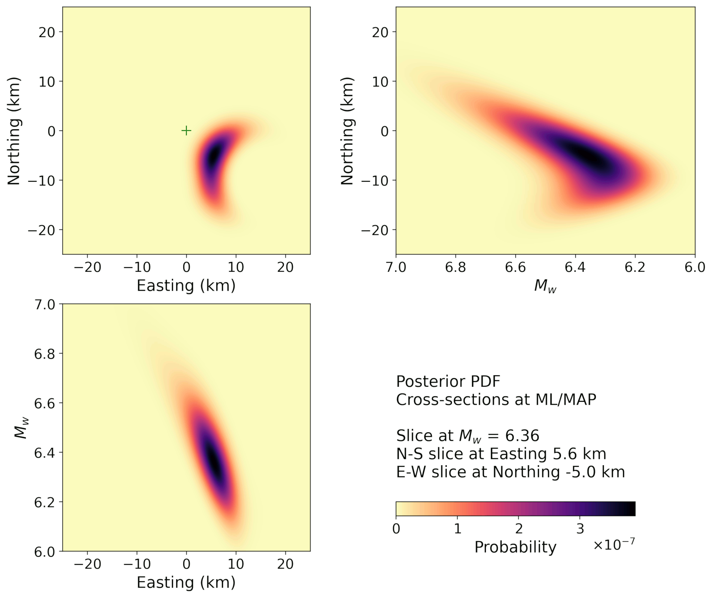

# High-Performance Bayesian earthquake location from seismic intensity

A JAX-accelerated Python framework for seismic source inversion and uncertainty quantification. It uses instrumental seismic intensity data from Japan, USA, and Europe (both historical and modern intensity observations).

<a href="#cite"></a>
[](https://doi.org/10.5281/zenodo.19379171)
[](https://doi.org/10.5281/zenodo.19603409)


[](https://www.python.org/dev/peps/pep-0008/)
-%234285F4?style=flat)


---

This tool is a high-performance Python framework designed for Bayesian inversion of 
earthquake epicenters and moment magnitudes (M<sub>w</sub>). Following the 
probabilistic inverse theory of Tarantola (2005), it fully accounts for uncertainties 
in both the measured data (seismic intensity) and the theoretical model (ground motion 
prediction equation, GMPE). The system evaluates the posterior Probability Density 
Function (PDF) for the epicenter location and magnitude via an exhaustive 3D grid search,
ensuring no local minima are missed. By leveraging JAX for massive parallelization, it 
allows for near-instantaneous evaluation on both CPU and GPU, making it ideal for both 
real-time modern seismology and the processing of historical earthquakes. Key Features:
* **HPC Ready:** Fully vectorized backend using JAX (XLA) with seamless support for CPU/GPU/TPU acceleration.
* **Bayesian Framework:** Complete 3D PDF evaluation accounting for both observational and modeling errors.
* **Automatic Site Effects:** Integrated workflow for automated V<sub>S30</sub> retrieval from a high-resolution J-SHIS-derived SQL database for Japan (for sites in Japan without direct V<sub>S30</sub> measurements).
* **Historical & Modern Data:** Support for both recent instrumental records and historical observations.
* **User-Friendly:** Simple ASCII input/output, PEP8 compliant, and structured for researchers and Python-beginners.

## 1 METHODOLOGY

The inversion follows the probabilistic theory and total error budget 
accounting for both observational and theoretical uncertainties as described in Tarantola (2005).

  Tarantola, A. (2005, Chapter 7.1). Inverse Problem Theory and Methods 
for Model Parameter Estimation, Society for Industrial and Applied 
Mathematics, Philadelphia, USA.

## 2 LOCALIZATION

### Japan

* **JMA Seismic Intensity Scale (Shindo):**
  * This tool can evaluate instrumental seismic intensity following the Japan Meteorological Agency (JMA) Shindo scale methodology, based on the prediction equations by Morikawa and Fujiwara (2013). Technical details on the JMA Seismic Intensity Scale can be found on the JMA website ([EN-figure](https://www.jma.go.jp/jma/en/Activities/intsummary.pdf), [EN-table](https://www.jma.go.jp/jma/en/Activities/inttable.html), [JP](https://www.jma.go.jp/jma/kishou/know/shindo/index.html)).
  * Morikawa, N. and Fujiwara, H. (2013). A New Ground Motion Prediction Equation for Japan Applicable up to M9 Mega-Earthquake. J. Disaster Res., 8(5), 878-888. [https://doi.org/10.20965/jdr.2013.p0878](https://doi.org/10.20965/jdr.2013.p0878)
* **V<sub>S30</sub> Database:**
  * If missing V<sub>S30</sub> values are detected, the system automatically interfaces with an optimized SQLite subset of the J-SHIS-derived database for Japan (Hallo, 2026), and assigns V<sub>S30</sub> values from the database.
  * The database is a processed subset (derivative research work) of the J-SHIS seismic hazard data from the National Research Institute for Earth Science and Disaster Resilience (NIED). Technical details on the J-SHIS seismic hazard data can be found on the J-SHIS website ([EN](https://www.j-shis.bosai.go.jp/en/), [JP](https://www.j-shis.bosai.go.jp/)).
  * Hallo, M. (2026). Research Dataset: Optimized Site Parameters Vs30 for Seismic Hazard Analysis in Japan (derived from J-SHIS) (v1.0) [Dataset]. Zenodo. [https://doi.org/10.5281/zenodo.19379171](https://doi.org/10.5281/zenodo.19379171)

### North America (USA)

* **Modified Mercalli Intensity Scale (MMI):**
  * This tool can evaluate instrumental seismic intensity following the Modified Mercalli Intensity (MMI) scale methodology, based on the prediction equations by Atkinson et al. (2014). Technical details on the MMI scale can be found on the [USGS website](https://www.usgs.gov/programs/earthquake-hazards/modified-mercalli-intensity-scale).
  * Atkinson, G.M., Worden, C.B., and Wald D.J. (2014). Intensity Prediction Equations for North America. Bulletin of the Seismological Society of America, 104 (6): 3084–3093. [https://doi.org/10.1785/0120140178](https://doi.org/10.1785/0120140178)

### Europe

* **European Macroseismic Scale (EMS-98):**
  * This tool can also evaluate instrumental seismic intensity in the European Macroseismic (EMS-98) scale. Technical details on the European Macroseismic (EMS-98) scale can be found on the [GFZ website](https://www.gfz.de/en/section/seismic-hazard-and-risk-dynamics/data-products-services/ems-98-european-macroseismic-scale).
  * **Mediterranean/Italy**: It is based on the PGV prediction equations by Bindi et al. (2011) and PGV-to-Intensity conversion by Faenza and Michelini (2010).
  * **Switzerland**: It is based on the PGV prediction equations by Cauzzi et al. (2015) and PGV-to-Intensity conversion by Faenza and Michelini (2010). Technical details can be found on the [SED website](https://www.seismo.ethz.ch/en/knowledge/faq/what-does-ems-98-mean/).
  * Bindi, D., Pacor, F., Luzi, L., Puglia, R., Massa, M., Ameri, G., and Paolucci, R. (2011). Ground motion prediction equations derived from the Italian strong motion database. Bulletin of Earthquake Engineering, 9, 1899–1920. [https://doi.org/10.1007/s10518-011-9313-z](https://doi.org/10.1007/s10518-011-9313-z)
  * Cauzzi, C., Faccioli, E., Vanini, M., and Bianchini, A. (2015). Updated predictive equations for broadband (0.01–10 s) horizontal response spectra and peak ground motions, based on a global dataset of digital acceleration records. Bulletin of Earthquake Engineering, 13(6), 1587–1612. [https://doi.org/10.1007/s10518-014-9685-y](https://doi.org/10.1007/s10518-014-9685-y)
  * Faenza, L. and Michelini, A. (2010). Regression analysis of MCS intensity and ground motion parameters in Italy and its application in ShakeMap. Geophysical Journal International, 180 (3), 1138–1152. [https://doi.org/10.1111/j.1365-246X.2009.04467.x](https://doi.org/10.1111/j.1365-246X.2009.04467.x)

## 3 TECHNICAL IMPLEMENTATION

The computational engine is engineered for maximum throughput by bypassing standard Python execution loops in favor of **XLA (Accelerated Linear Algebra)**:

* **JIT Compilation:** Every critical path, from the Forward GMPE evaluation to the Likelihood summation, is Just-In-Time (JIT) compiled. This transforms Python code into optimized machine code tailored for the specific hardware (CPU, GPU, or TPU).
* **Multi-Device Scaling:** Using JAX allows the grid-search to be offloaded to GPU/TPU without code changes. On multi-core CPUs, it utilizes all available threads via vectorized operations rather than standard multiprocessing.
* **Vectorized Grid Search:** Instead of iterative loops, the framework uses nested vectorization (`vmap`). The 3D parameter space is treated as a high-dimensional tensor, allowing the hardware to evaluate thousands of potential epicenters and magnitudes in a single clock cycle.
* **SQLite Spatial Indexing:** Automatic retrieval is powered by a high-performance SQLite backend. This allows for rapid spatial lookups within a processed database.
* **PEP8 & Linting:** The codebase is strictly linted using **Flake8** ensuring high maintainability.
* **Modular I/O:** Designed with a decoupled architecture, allowing the core inversion engine to be wrapped into automated APIs or triggered via CLI as part of a larger pipeline.

## 4 PACKAGE CONTENT

1. `utils/` — Directory containing supporting Python modules and SQL interface
2. `location_intensity.py` — Main execution script for the Bayesian inversion
3. `config.py` — Configuration module to define inversion parameters and search area
4. `constants.py` — Module defining constants, intensity scales, and color schemes
5. `geodata.py` — Module for geographical coordinates preparation and V<sub>S30</sub> handling
6. `plotting.py` — Module for high-quality visualization of results and PDFs
7. `INPUT.txt` — Example input file with JMA observed seismic intensity data and V<sub>S30</sub> values
8. `requirements.txt` — Pip requirements file for automated installation of dependencies

## 5 REQUIREMENTS

Python: Version 3.12 or higher
  
Libraries: jax, numpy, matplotlib, pandas, geopandas, sqlalchemy, requests, shapely, psutil

Install dependencies via pip:

```bash
pip install -r requirements.txt
```

## 6 USAGE

1. Prepare your `INPUT.txt` input file (see the detailed format in the comments of `config.py`)
2. Set up the search area and inversion parameters in the `config.py` file
3. Execute the inversion: `python location_intensity.py`
4. Check the `results` directory for output figures and the summary text file

## 7 EXAMPLE OUTPUT

The computation process is monitored, and the tool informs the user in real-time about the progress:
```text
[*] Seismic intensity scale: JMA
[*] Read input file
[*] Prepare input data
[*] Found 34 invalid Vs30 values
[*] Check or download SQLite database
[*] Initialize SQL engine
[*] Extracting missing Vs30 data from SQL
[+] SUCCESS: Vs30 values assigned from SQL database
[+] SUCCESS: Updated file saved to: UPDATED_INPUT.txt
[*] Vectorize data for JAX
[*] Memory Usage Forecast
    Grid dimensions:       1001 x 1001 x 201
    Number of stations:    163
    Final 3D matrix (RAM): 0.81 GB
    JAX peak per slice:    0.65 GB
    Available System RAM:  15.97 GB
[*] SUCCESS: Memory check passed
[*] Evaluate probability in 3D model space (Parallel-JAX)
    Progress:  30.3%
    Progress:  60.2%
    Progress:  90.0%
    Progress: 100.0%
[*] SUCCESS: 3D PDF evaluation finished
[*] Estimating ML/MAP solution
[*] Estimating solution uncertainties from marginal PDFs
[*] Compute Posterior Mean (PM) solution
[*] Save results to a text file
[+] SUCCESS: Results saved to: results/20260416_144319_loc.txt
[*] Evaluating misfit for the ML/MAP solution
[*] Plot results
[+] SUCCESS: Saved to results/20260416_144319_loc_map.png
[+] SUCCESS: Saved to results/20260416_144319_loc_pdf_cross_section.png
[+] SUCCESS: Saved to results/20260416_144319_loc_pdf_marginal.png
[+] SUCCESS: Saved to results/20260416_144319_loc_misfit.png
[*] SUCCESS: All done
```

Regarding the results, the figure below illustrates the output 3D posterior Probability Density Function (PDF) with orthogonal slices (M<sub>w</sub>, N-S, E-W) passing through the Maximum Likelihood (ML) solution.

<picture>
  <source media="(prefers-color-scheme: dark)" srcset="img/int_dark.png">
  <source media="(prefers-color-scheme: light)" srcset="img/int_light.png">
  
</picture>

The tool saves results into a structured text file. It contains precise coordinates for the Maximum 
Likelihood (ML) or Maximum A Posteriori (MAP) solutions (which are identical in this case), including standard 
deviations (1σ) and double standard deviations (2σ) to quantify spatial uncertainty. Additionally, the output 
includes the Posterior Mean (PM) solution, which is particularly useful for characterizing the location in cases 
of highly asymmetric posterior PDFs.
```text
# SOLUTION FOR THE EARTHQUAKE EPICENTER LOCATION
# --------------------------------------------------------------------
# Maximum Likelihood (ML) / Maximum a Posteriori (MAP)
# Latitude, Longitude, Mw, Easting, Northing, E_sigma, N_sigma, Mw_sigma, E_2sigma, N_2sigma, Mw_2sigma [km]
  35.05460  135.66053  6.36    5.550   -5.000    4.442    6.517    0.216    8.885   13.035    0.431
# --------------------------------------------------------------------
# Posterior Mean solution (PM)
# Latitude, Longitude, Mw, Easting, Northing [km]
  35.06636  135.65568  6.46    5.099   -3.699
```

## 8 COPYRIGHT

Copyright (C) 2026 Kyoto University

This program is published under the GNU General Public License (GNU GPL).

This program is free software: you can modify it and/or redistribute it
or any derivative version under the terms of the GNU General Public
License as published by the Free Software Foundation, either version 3
of the License, or (at your option) any later version.

This code is distributed in the hope that it will be useful, but WITHOUT
ANY WARRANTY. We would like to kindly ask you to acknowledge the authors
and don't remove their names from the code.

You should have received a copy of the GNU General Public License along
with this program. If not, see <http://www.gnu.org/licenses/>.

<a name="cite"></a>
## 9 CITE AS

If you use this tools suite, please cite both the original database and the software as follows:

### For the V<sub>S30</sub> database (Japan):
> Hallo, M. (2026). Research Dataset: Optimized Site Parameters Vs30 for Seismic Hazard Analysis in Japan (derived from J-SHIS) (v1.0) [Dataset]. Zenodo. [https://doi.org/10.5281/zenodo.19379171](https://doi.org/10.5281/zenodo.19379171)

### For the specific software version:
> Hallo, M. (2026). JAX-accelerated Bayesian earthquake location from seismic intensity (v1.1) [Software]. Zenodo. [https://doi.org/10.5281/zenodo.19603409](https://doi.org/10.5281/zenodo.19603409)
